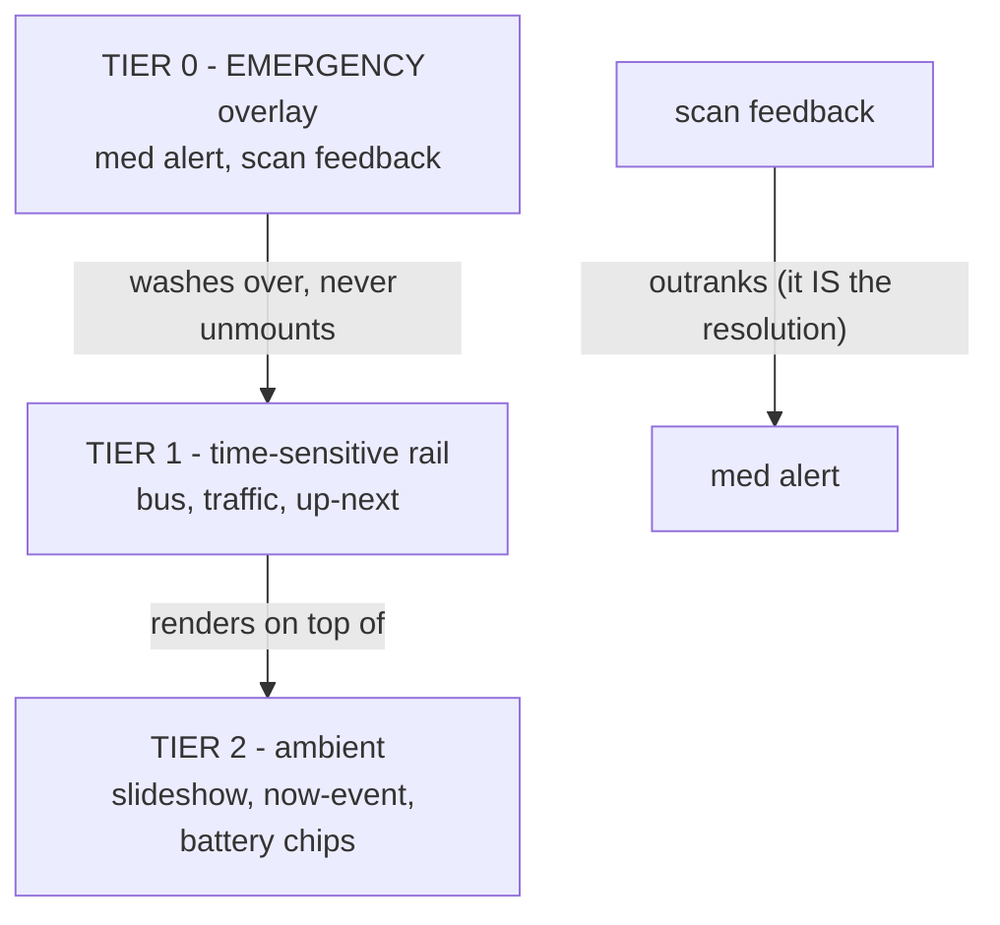

# SPEC-DASHBOARD — the wall has too many voices, give them a protocol

The dashboard started as a slideshow with one overlay. It's now five surfaces
composed in an ad-hoc ZStack, with battery (H1) and traffic (TR1) queued up to
join — every new feature invents its own placement, its own font sizes and its
own idea of how important it is. This spec defines the protocol they all render
through instead: three priority tiers, explicit interruption rules and a shared
card rail (D1.3 builds it, D1.4 migrates onto it).

Scope: WHAT renders where and when it may interrupt. Layout geometry (where the
rail sits, how cards look) is D1.2's mockup decision — this spec constrains it,
it doesn't draw it.

## Surface inventory

| Surface | Feature | Status | Tier | Gate | Update cadence |
|---|---|---|---|---|---|
| Photo slideshow | `SlideShowFeature` | live | ambient (base layer) | album configured | continuous (Ken Burns) |
| Med late alert | `AlertLoaderFeature` → `AlertView` | live | EMERGENCY overlay | late window + not scanned + trackee enabled | 30s tick |
| Scan feedback | `TagScanLoaderFeature` | live | EMERGENCY overlay (transient) | tag tap | event-driven, tap to dismiss |
| Calendar "Now" | `CalendarEventsFeature` → `NowView` | live | ambient | event in progress | 30s tick |
| Calendar "Up next" | `CalendarEventsFeature` → `UpNextView` | live | time-sensitive rail | event within 60 min | 30s tick |
| Bus arrivals | `BusArrivalsFeature` → `BusArrivalsBar` | live | time-sensitive rail | bus window + enabled + stops configured | 30s poll |
| Battery chips | `BatteryAlertsFeature` (H1) | planned | ambient | enabled + a battery low | 30 min poll |
| Traffic / drive time | `TrafficAlertsFeature` (TR1) | planned | time-sensitive rail | traffic window + routes configured | 5 min poll |

## The three tiers

- **Tier 0 — EMERGENCY overlay.** Owns the full screen. A missed dose still
  outranks the world: the med alert is the reason this wall exists, everything
  else is decoration. Members: med late alert (red wash, persists until
  scanned), scan feedback (green/amber wash, transient).
- **Tier 1 — time-sensitive rail.** Cards that matter in the next hour: bus
  ETAs, drive times, the up-next calendar event. Priority-ordered in ONE shared
  rail (D1.3's card model) — features contribute typed cards, the dashboard
  owns placement. No feature invents its own bar again.
- **Tier 2 — ambient.** Glanceable, never urgent: the slideshow itself, the
  in-progress event title, battery chips (a AAA dying over three days is not an
  emergency, it's a chore reminder).

## Interruption rules

1. Tier 0 renders OVER everything at half-alpha — the rail and slideshow stay
   mounted and visible through the wash (today's behavior, keep it: the wash
   says LOOK AT ME without hiding the bus you're also about to miss).
2. Scan feedback stacks above the med alert. Tapping the tag is the ACT of
   resolving the alert — the thank-you must win the screen for its moment.
   (Today's ZStack order already does this; the spec makes it law.)
3. Tier 1 cards NEVER interrupt: they enter and leave the rail with
   transitions, they don't flash, they don't wash. Urgency inside the rail is
   styling (the red "late" capsule), not motion.
4. Tier 2 never occludes Tier 1. Ambient chips live in a corner the rail
   doesn't use (mockup decision, D1.2).
5. Within a tier, ordering is by card priority (below), not by which feature
   mounted first.

## Gating and the screen-off interplay

- Every Tier 1 source carries a window gate (`busWindow`, TR1's traffic
  window). Outside the window the card does not exist — not dimmed, GONE. An
  errored source shows one compact error chip in the rail (lowest priority),
  not a full-width banner: the wall's job is family info, not devops.
- Screen-off (`ScreenOffMonitorFeature`) trumps Tiers 1 and 2: a dark panel is
  dark. Tier 0 med alerts FORCE the screen on (the existing late-reminder
  force-on) — the one thing worth waking the wall for. Scan feedback never
  wakes the screen (nobody scans a dark wall; if they do, the med alert
  already lit it).
- All gates evaluate on the source feature's own cadence; the rail just
  renders what it's handed. Gating lives with the data, layout with the
  dashboard.

## Type scale — readable from across the room

Two viewing-distance classes, because the same UI serves the kiosk's 32" LG
wall monitor at room distance and two 9th-gen iPads at arm's length. EVERY panel runs PORTRAIT — width is
the scarce axis, height is plentiful, so the "rail" is a vertical stack and
vertical position carries meaning: ambient lives up high (glanceable), the
time-sensitive stack sits in the lower half (eye level from the couch):

| Role | Wall 32" (pt) | iPad (pt) | Today |
|---|---|---|---|
| Tier 0 overlay headline | 200 | 80 | 200 ✓ |
| Tier 0 overlay body | 80 | 44 | 80 ✓ |
| Rail card primary (ETA, route number) | 48 | 28 | 20 ✗ (`.title3`) |
| Rail card secondary (label, "in 4 min") | 32 | 20 | 12-16 ✗ (`.caption`) |
| Ambient chip / floor for ANY text | 24 | 14 | 12 ✗ |

The 200pt overlay headline is the empirically-validated anchor — it ships on
the live kiosk today and reads from anywhere in the room; the rail numbers are
derived relative to it. The current `BusArrivalsBar` was designed at desk
distance and its captions are
unreadable from the couch (the ✗ column is why D1.4 re-renders it through the
card model instead of restyling in place). Hard rule going forward: nothing
below the 24pt floor ships to the wall. D1.5 verifies the scale AT distance —
numbers here are the starting bid, the couch is the judge.

## Rail capacity and overflow

- Max 4 simultaneous cards on the wall, 3 on iPad — capacity is STACK DEPTH
  (portrait panels), not rail width. Past that, ETAs stop being readable at
  distance and the wall becomes a departures board.
- Priority order: late/degraded things first — (1) late bus, (2) slow route,
  (3) on-time bus, (4) on-time route, (5) up-next event, (6) error chip.
  Ties break by soonest ETA.
- Overflow: render the top N by priority plus a "+2 more" chip — dropped
  silently is a lie, and a wall that lies gets ignored. The chip is not
  interactive (the wall monitor takes no touches; a tap anywhere exits to
  settings); it exists so a missing card reads as "over capacity", never
  "broken".
- Unit tests on ordering and overflow are D1.3's exit criteria, not this
  spec's.

## What this spec does NOT cover

- Layout geometry, card visuals, corner assignments — D1.2 mockups (REVIEW
  GATE with chotchki; nothing below the gate starts until a candidate is
  picked).
- The card model's Swift API — D1.3, constrained by: typed cards carrying
  (content, tier, priority, gate) with the dashboard owning render order.
- Whether the Mac renders battery cards at all — H1.1's probe decides.
